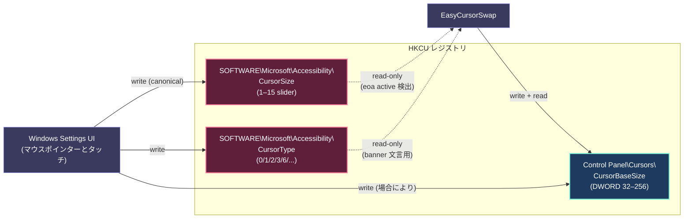
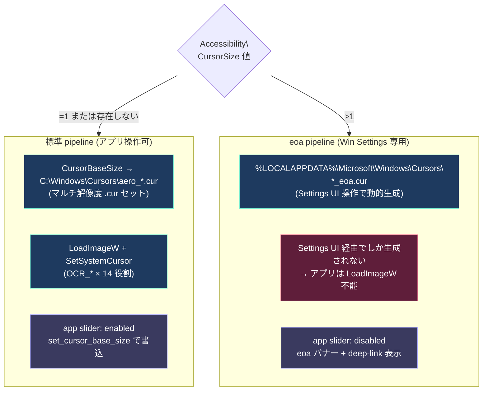
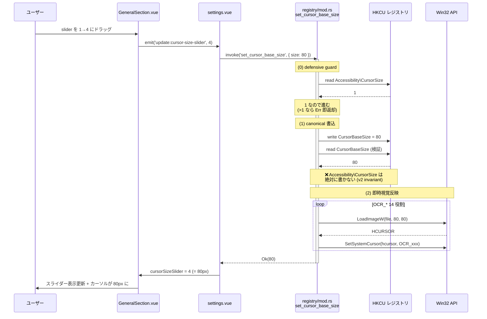
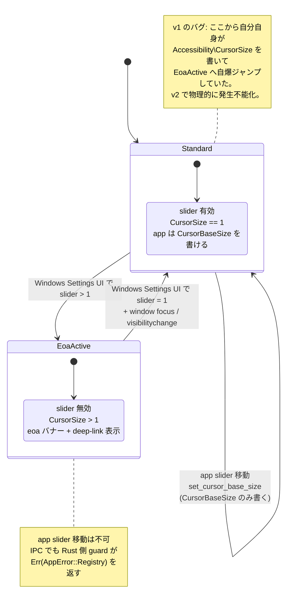
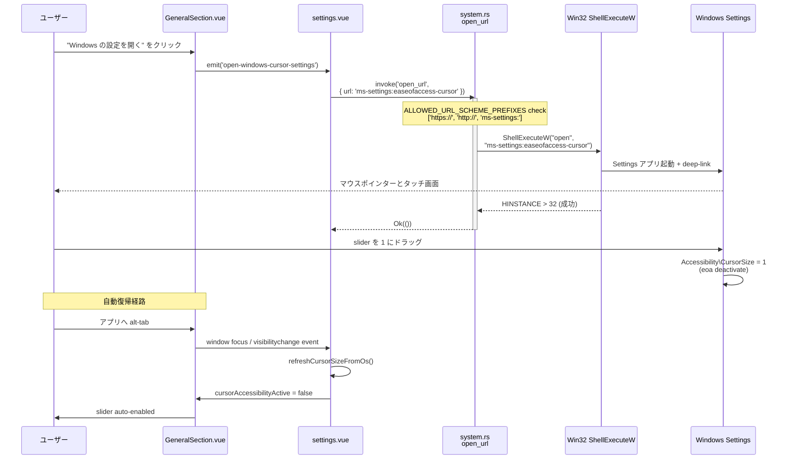

# Cursor Size Architecture (v2 / 2026-05-23)

設定 → 一般 → カーソルサイズ 機能のアーキテクチャを Mermaid 図でまとめたもの。
バグ修正と再設計の歴史: 過去 9 commits (`e03c8e0` → `1f85aec`) 通して安定するまで揺れたため、
ここで「**今の正しい姿**」を 1 ページに固定する。

関連:

- 仕様: `docs/superpowers/specs/2026-05-23-cursor-size-redesign-v2.md` (local-only)
- Critical invariant: `docs/architecture.json` → `critical_invariants[].cursor_size_app_writes_only_cursorbasesize`
- Security 表: `docs/architecture.md` の Security セクション末尾
- Living docs: `docs/file_inventory.md` (`registry/mod.rs` / `accessibility.rs` 行)

---

## 1. レジストリ所有権マトリクス

Windows 10 22H2+ / Win11 はカーソル設定の保存先を **2 系統** に分割している。
アプリは片方だけを操作し、もう片方は読み取り専用で扱う。



**ルール**:
- 🟦 青枠 `CursorBaseSize` — アプリの書込先。OS も書く場合があるが、アプリは自由に書き換えてよい。
- 🟥 赤枠 `Accessibility\*` — OS (Windows Settings UI) の専用領域。アプリは **絶対に書かない**。書くと eoa pipeline が誤起動し、対応する `*_eoa.cur` ファイルが存在しないためカーソルが破綻する。

---

## 2. 標準 pipeline vs eoa pipeline

Windows は `Accessibility\CursorSize` の値で 2 つのカーソル供給経路を切り替える。
本アプリは標準 pipeline でのみカーソルを変更し、eoa active 中は UI を disabled にする。



---

## 3. 書込フロー (`set_cursor_base_size`)

ユーザーが app slider を動かしたときの IPC コール全体。



**重要ポイント**:
- step (0) の defensive guard は二重防御 (UI 側 `cursorAccessibilityActive` gate + Rust 側 reject)。
- step (1) で `Accessibility\CursorSize` を**書かない**ことが今回 (v2) の根本修正。
- step (2) は `SystemParametersInfoW(SPI_SETCURSORS)` を**使わない** — broadcast すると `cursor_watcher` が echo して focus 戻り時に二重反映ループが起きた経緯がある。

---

## 4. 読込フロー (`resolve_cursor_base_size`)

アプリ起動 / 「OS から再取得」/ window focus 時に呼ばれる。
**優先順位** が v2 で変わったポイント。

```mermaid
flowchart TB
    classDef in fill:#1e3a5f,stroke:#7cf2d4,color:#fff
    classDef out fill:#3a3a5f,stroke:#aaaaff,color:#fff
    classDef dec fill:#5f5f1e,stroke:#ffff7c,color:#fff

    AS["accessibility_slider<br/>: Option&lt;u32&gt;"]:::in
    CB["cursor_base_size<br/>: Option&lt;u32&gt;"]:::in

    AS --> D1{Some?}
    D1 -->|None| D2
    D1 -->|Some s| D3{s > 1?}

    D3 -->|Yes| R1["eoa active<br/>slider_position_to_base_size(s)<br/>(48 / 64 / .. / 256)"]:::out
    D3 -->|No (s=1)| D2

    D2{cursor_base_size<br/>Some?}
    D2 -->|Some b| R2["clamp_cursor_base_size(b)<br/>= 32 ≤ b ≤ 256"]:::out
    D2 -->|None| R3["DEFAULT_CURSOR_BASE_SIZE<br/>= 32"]:::out

    classDef decstyle stroke:#ffff7c
    class D1,D2,D3 decstyle
```

**v1 (旧) との違い**: v1 では `Accessibility\CursorSize=1` のときも slider=1 → 32px を返していたため、アプリが `CursorBaseSize=80` と書いた直後に read すると 32px に戻り、UI slider が勝手に 1 に巻き戻る round-trip 不能状態だった。v2 は **`slider > 1` のときだけ Accessibility を採用** することで round-trip を成立させる。

---

## 5. UI 状態マシン (case E gate)

アプリスライダーは Windows 側の状態に応じて enabled / disabled を切り替える。
ユーザー操作と OS 操作の境界を明確にする状態遷移図。



---

## 6. 復旧経路 (deep-link)

eoa active 状態に陥ったユーザーが標準 pipeline に戻るための導線。



**v2 で修正したバグ**: `open_url` IPC が `ms-settings:` を `AppError::InvalidInput("不正な URL スキーム")` で reject していたため、deep-link ボタンを押しても何も起きなかった (`fix(deep-link)` commit `1f85aec` で `ALLOWED_URL_SCHEME_PREFIXES` を導入)。

---

## 7. 不変条件一覧 (v2 時点)

| # | 不変条件 | 担当ファイル | 検証 |
|---|---|---|---|
| 1 | HKCU のみ書く / HKLM 不接触 / UAC 不要 | `registry/mod.rs` | `set_cursor_base_size` テスト |
| 2 | アプリは `HKCU\SOFTWARE\Microsoft\Accessibility\*` を**書かない** | `registry/mod.rs::set_cursor_base_size` | `set_cursor_base_size_writes_dword_round_trip` が `slider_raw == 1` を assert |
| 3 | eoa active (CursorSize > 1) のとき `set_cursor_base_size` は `Err` を返す (defensive guard) | `registry/mod.rs::set_cursor_base_size` step (0) | `set_cursor_base_size_rejects_when_accessibility_active` |
| 4 | read 優先順位: eoa active のときのみ Accessibility、それ以外は CursorBaseSize | `accessibility.rs::resolve_cursor_base_size` | `resolve_prefers_accessibility_only_when_eoa_active` |
| 5 | フロント `cursorAccessibilityActive = cursor_size_slider != 1` で slider gate | `app/components/settings/GeneralSection.vue` | smoke test |
| 6 | `open_url` IPC は `ALLOWED_URL_SCHEME_PREFIXES` (`https://` / `http://` / `ms-settings:`) のみ受付 | `src-tauri/src/commands/system.rs` | `is_allowed_url_scheme_*` 2 件 |

---

## 8. 関連コミット史 (archeology)

| Commit | 内容 | 役割 |
|---|---|---|
| `e03c8e0` | initial slider feature | broadcast 経路だけで視覚反映できず |
| `41574f7` | force WM_SETTINGCHANGE | broadcast は CursorBaseSize 再評価しない |
| `cee1398` | role path 再書込 | pipeline 切替に上書きされる |
| `d96296c` | `LoadImageW` + `SetSystemCursor` | 正しい経路だが step (1) が妨害 |
| `229038e` | `KEY_READ \| KEY_WRITE` | permission 修正、別バグ |
| `9d16c2b` | sync slider with Windows | **このバグ (eoa 起動) を導入** |
| `62f29de` | one-way write architecture | feedback loop は消えたが registry 書込は残った |
| `c3863aa` | eoa-aware UI gate (case E) | self-trigger するゲートを追加してしまう |
| `4483bf4` | **redesign v2 (root fix)** | Accessibility 書込を完全削除 |
| `1f85aec` | deep-link allow-list | `ms-settings:` を `open_url` に許可 |

この 10 commits 通して安定した。`4483bf4` (root fix) と `1f85aec` (deep-link allow-list) が v2 セット。
